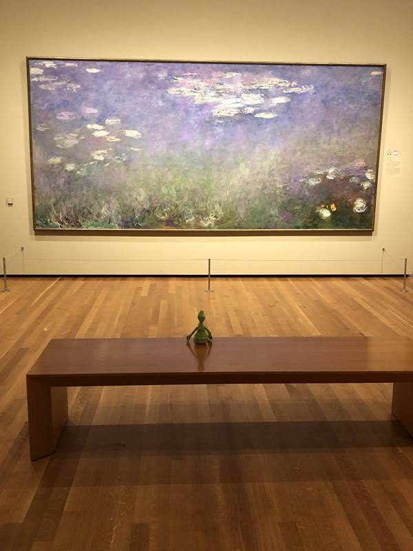

# My First Coding Assignment

## About Me ##
My name is Kristine Christensen. I am a lifelong learner who enjoys the challenge of learning new things. I like to weld, create art, and travel. I am also interested in learning more about coding and am looking forward to being able to transfer what I learn in this class into my classroom instruction. 

## Past Coding Experience ##
I have some experience with C++ and Java (ugh) but I'm very rusty and out of practice. I do have some HTML and CSS experience but it is very outdated and needs a complete refreshining. 

## Career Goals ##
I am pretty set in my career and do not anticipate changing anything but you never know. Part of my career goals is to keep learning so I would include the following in my goals:
* Complete the coursework towards attaining my MA in Mass Communications with an emphasis in Web Design from University of Florida
* Complete my coursework in cybersecurity at Georgia Tech. 
    * Pass the Security+ Exam
    * Study for the Cybersecurity Maturity Model Certification
* Complete my Emergency Management Certificate